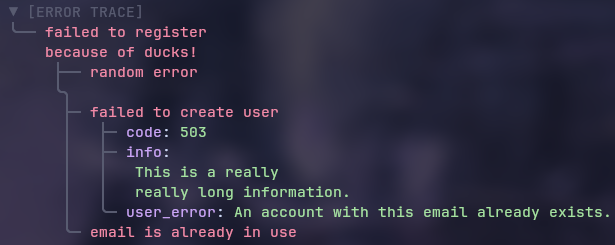

# 🍃 v0.4.0 Is Here

This release is a **massive** step forward.

The core pipeline is now up to **5x faster**, uses up to **76% less memory**, and **cuts allocations by up to 98%**.
Check out the [benchmarks](Benchmarks.md)!

We also **redesigned the API** to make common workflows simpler, added support for **nested error trees**,
and cleaned up a lot of rough edges.

Enjoy!

# About

`erax` is a Go package that enhances error handling with structured metadata and beautiful CLI output. It treats errors as first-class data structures, not just strings.

It provides error chaining, custom metadata, and styled error traces using
the [lipgloss](https://github.com/charmbracelet/lipgloss) library.



# 🖤 Features

- 🌈 Styled and readable **error trace** output for CLI
- 🔗 Error **chaining**
- 🏷️ Attach and retrieve key-value **metadata**
- 🎨 **Configurable** colors for trace output
- 🔄 **Compatible** with standard and third-party errors (e.g., pkg/errors)
- ⚡ Fast **JSON** serialization / deserialization

# 🔥 Wanna start NOW?

Below is a lame section for those who may feel unconfident.

If you are already cool enough - check out the [How To Use](HowToUse.md) guide.

# Why Go error handling sucks

Let's start with the line of code that everyone keeps passing down the stack:

```go
if err != nil {  
    return err  
}
```

Some of the developers **don't actually handle errors**.
They just kick them upstairs and hope the next layer figures it out.
And the reason behind it is that **they just don't actually understand how to trace errors**.
They treat error handling as an annoying chore rather than a core part of their workflow.

At some point people try to improve things:
They use standard library: `Errorf`, maybe a bit of `errors.Join`.
But almost nobody uses them consistently in large systems.
Wrap a couple of layers, and you end up with a monstrous, unreadable string chain:

```
failed to process payment: failed to charge card: gateway timeout: connection reset by peer
```

Once things get real, people need something substantial.

Because native Go error handling is fundamentally simple,
engineering teams usually adopt one of four core strategies to manage errors.
While each approach has its place, **none of them solve the modern observability problem completely** out of the box.

## 1. "We use a library"

Traditional Go error-handling libraries like [pkg/errors](https://github.com/pkg/errors)
(and frameworks heavily inspired by them) introduce structural **antipatterns** into modern,
high-scale Go applications. The core issue is the conflation of the error's causal chain with its
diagnostic snapshot. By forcing developers to attach heavy, unformatted execution trails at every wrapping boundary,
these solutions create massive data redundancy across application layers. Even with modern forks attempting to
patch compatibility, this approach fundamentally lacks semantic structure: it forces multidimensional context
into flat, unparsed text strings. Instead of enabling clean, machine-readable telemetry, it leaves teams with
bloated error values that are **difficult to inspect programmatically** and **impossible to cleanly map** to modern structured loggers.

## 2. "We'll just make our own error types"

Another pervasive issue in team environments is the uncontrolled proliferation of **custom error types**,
which leads to fragmented and unmaintainable codebases. When every team or package invents **its own error
structs** to pass context, it breaks encapsulation and severely complicates error inspection across layer boundaries.
Developers are forced to import multiple internal packages just to perform type assertions or use `errors.As()`,
creating **tight coupling between decoupled modules**. This antipattern obscures the true root causes of failures,
degrades the clarity of public APIs, and results in redundant error-handling logic that is notoriously difficult
to standardize and test.

## 3. "Why are we even wrapping errors, just log everything properly"

A major antipattern in modern Go applications is the premature coupling of error handling with logging
libraries like [zap](https://github.com/uber-go/zap) or [slog](https://github.com/coder/slog) at lower
architectural layers. When developers attempt to attach arbitrary context and operational metadata by
logging errors immediately where they occur, it leads to massive log pollution and duplicate, heavily
fragmented log entries as the error bubbles up the call stack. This practice fundamentally violates
the separation of concerns: lower-level packages shouldn't care about logging infrastructure, formatters,
or sinks. Instead of polluting business logic with logger dependencies, metadata must be encapsulated
directly within the error value itself as structured key-value pairs, allowing the top-level handler to
log a single, comprehensive entry with full diagnostic context.

## 4. "If we just had stack traces everywhere, life would be easier"

Finally, treating stack traces as a panacea for error diagnostics is a dangerous fallacy that addresses
the symptoms of poor error handling rather than the cause. Raw stack traces capture the where,
but completely fail to capture why they provide a low-level snapshot of execution paths without any of
the critical runtime data, user inputs, or business state that actually triggered the failure.
Relying on them as a primary debugging tool leads to monolithic, unreadable logs that hinder automation
and automated parsing.

## 👁️ The Epiphany

**erax** was explicitly engineered to eliminate these architectural antipatterns, delivering an elegant,
high-performance ecosystem where developer experience seamlessly meets production-grade efficiency.
Built with a strict `Developer-Experience-First` philosophy, **erax** provides a crystal-clear,
flawless API for wrapping errors and building error chains.

## 🌟 Why erax?

- **Visual Error Trees**: It renders **beautifully** structured, human-readable error trace trees that turn debugging from a frustrating chore into a visual pleasure, making the exact failure path instantly obvious.  
- **First-Class Metadata**: Dynamically attach structured **key-value** pairs to your errors at any abstraction layer.  
- **Blazing-Fast Native JSON**: Engineered for high-throughput microservices, **erax** features **ultra-optimized**, native serialization and deserialization, letting you ship rich diagnostics over the wire with minimal CPU footprint.  
- **Zero-Friction Compatibility**: Stays 100% **native** to Go's standard library. It works flawlessly with standard `errors.Is` and `errors.As` mechanics, while gracefully interoperating with third-party libraries out of the box.

# 🔮 Future features (coming soon)

In a short while, you will witness the following things:
- native `[]byte` JSON API
- `GetMetas() []MetaField`
- no-color mode
- ASCII branch style
- square branch style
- maybe some performance improvements
